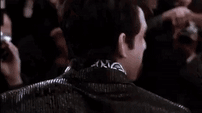
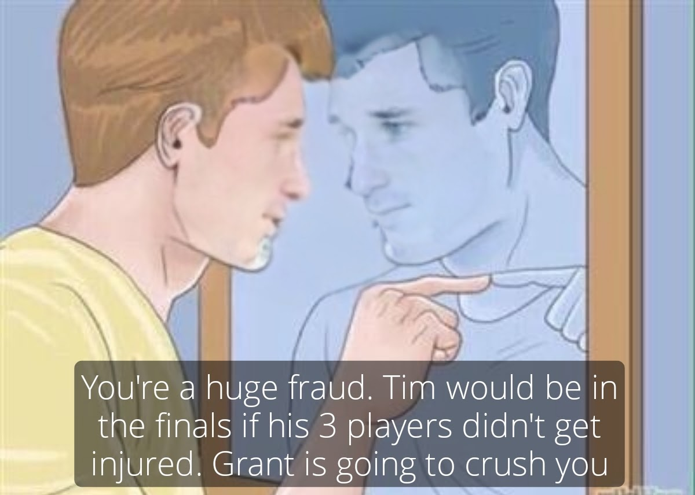

# Playoffs: Round 1 and 2 Recap
Did you miss me? Aww, well I didn't miss you.

## Round 1 Recap
This is a week late, but let's rip through it.

### *(5) How I Metcalf your Mother 114.34*, (4) Not so DangeRuss 97.82
Antonio's name change after jettisoning Russell Wilson a few weeks ago aptly summarized his playoff campaign in 2023. His 3rd round pick of Aaron Jones finally paid dividends as he scored a huge 8.9 points after missing a month.

Moving on to winning team led by Fantasy Dan. *Do do do dooo*, fantasy stat of the week: Rachaad White is the #3 fantasy RB on the year and Dan has taken full advantage of this in the last month.

### *(6) The Omnimen 137.16*, (3) One Team to Rule Them All 122.36
It's so boring talking about the winners. It's way more fun to make fun of Ryan's poor decisions. Ryan forgot to donate his ankle to help Tyreek recover, and he played Brandon McManus who has scored -1 points two weeks in a row.

Tim somehow has inside sources with the Texans and yolo'd a Devin Singletary start. After splitting the work with Pierce the last few weeks, Singletary got all the work and was the difference in this matchup.

### BYE Week Teams: It's Joever and I'm REALLY Thielen Myself
It's Joever completely lost to the BYE week as John lost Keaton Mitchell, Jayden Reed, and Ja'Marr Chase. Grant just chilled as he knows he is going to win the trophy. Nothing can stop him.

### Loser Facts
1. Riley stopped being delusional for the week.
2. The BOAT continued to sink.
3. Jeff stole the Vegas DST from playoff teams (scored 25 points).

## Round 2 Recap
Finally, we can talk about current events and not ancient history.

### *(2) It's Joemas 100.4*, (6) The Omnimen 94.02

This matchup was very contentious, until it wasn't. The Omnimen suffered three mid-game injuries (Addison, Kmet, and Dustin Hopkins) on Christmas Eve. The matchup looked all but over with Tim + Saquon only holding a 10 point led on John's 4 remaining Christmas players. John started getting ahead of himself and making championship memes.

The Chiefs started Christmas with a terrible offensive performance, while Saquon had a good performance for Tim. With Tim leading by 10 points against John's Purdy and Justin Tucker, things looked dire for the Omnimen. Then Brock Purdy completely fumbled the MVP bag by throwing 4 interceptions in a Christmas primetime game. Tim thought he was watching the start of a Christmas miracle until the dainty little toes of Justin Tucker worked their magic. Sorry, better luck next year (I'm definitely not a fantasy fraud).

### *(1) I'm REALLY Thielen Myself 168.2*, (5) How I Metcalf your Mother 111.96
This matchup in meme form:

After Alvin Kamara (6.0) and Pat Freiermuth (0.000) put up stinkers to start Dan's week, we all knew there was no way he could beat Grant's juggernaut of a team. Grant's trade for Justin Jefferson finally paid off as he hit the griddy for the first time since Week 4.

The main talking point of this matchup is whether the league should have playoff reseeding. If the playoffs were reseeded, Dan and Grant would be in the championship. Also, if kickers were removed, Tim would have defeated John. These are going to be two hot button topics when the fantasy change form is sent out.

### Championship: (2) It's Joever vs (1) I'm REALLY Thielen Myself (-12.2)
Get your bets in now.

### Loser Facts
1. Antonio scored 161.34 points for no reason as he is playing Ryan again in Week 17 to decide 5th place.
2. Riley is delusional again, and facing Shane in the Toilet Bowl.
3. Amari Cooper scored 46 points for the BOAT
